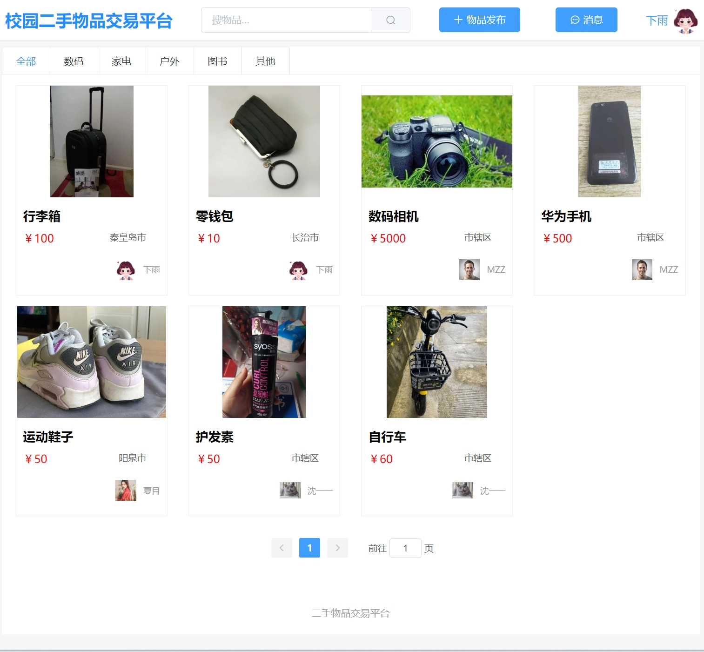
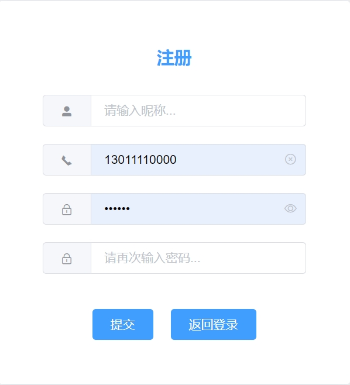

---
### 👉作者QQ ：1556708905 微信：zheng0123Long (支持修改、部署调试、定制毕设)

### 👉接网站建设、小程序、H5、APP、各种系统等

### 👉选题+开题报告+任务书+程序定制+安装调试+ppt 都可以做
---

**博客地址：
[https://blog.csdn.net/2303_76227485/article/details/135458350](https://blog.csdn.net/2303_76227485/article/details/135458350)**

**视频演示：
[https://www.bilibili.com/video/BV1x64y1K76M/](https://www.bilibili.com/video/BV1x64y1K76M/)**

**毕业设计所有选题地址：
[https://github.com/zhengjianzhong0107/allProject](https://github.com/zhengjianzhong0107/allProject)**

## 基于Java+Springboot+Vue的校园二手商城管理系统(源代码+数据库+8000字论文)117

## 一、系统介绍
本项目前后端分离，本系统分为管理员、用户两种种角色

### 1、用户：
登录、注册、商品搜索、商品购买、二手商品发布、联系卖家、订单管理、我的收藏管理、我的发布管理、个人信息、密码修改

### 2、管理员：
商品管理、订单管理、用户管理

### 3、文档目录截图：

## 二、所用技术

后端技术栈：

- Springboot
- Mybatis
- Mysql
- Maven

前端技术栈：

- Vue 
- Vue-router 
- axios 
- elementUi

## 三、环境介绍

基础环境 :IDEA/eclipse, JDK1.8, Mysql5.7及以上,Maven3.6, node14, navicat

所有项目以及源代码本人均调试运行无问题 可支持远程调试运行

## 四、页面截图
### 1、用户

### 2、管理员

## 五、浏览地址

访问地址：http://localhost:8081/

- 职工账号/密码：10088/123456
- 管理员账号/密码：11/123123

## 六、部署教程
1. 使用Navicat或者其它工具，在mysql中创建对应名称的数据库，并执行项目的sql文件
2. 使用IDEA/Eclipse导入second-hand goods-trading -back项目，若为maven项目请选择maven，等待依赖下载完成
3. 修改application.properties里面的数据库配置和文件路径配置，启动后端项目
4. vscode或idea打开second-hand goods-trading -front项目
5. 在编译器中打开terminal，执行npm install 依赖下载完成后执行 npm run dev,执行成功后会显示访问地址

